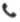

이름 : 박 지 훈

 [znzldh12@naver.com](mailto:znzldh12@naver.com)

 010-4795-1266

 [https://mrdevelop.tistory.com/](https://mrdevelop.tistory.com/)

-----

## My Purpose
미니멀리즘 개발자

----
### More Information
----
#### School
- 서일고등학교 (2012 ~ 2015)
- 한밭대학교 (2015 ~ 2020)

#### Skills
- Kotlin

----
### Contents
----
- 오픈 소스를 활용한 높은 퀄리티의 안드로이드 애플리케이션이   
사용자들에게 양질의 서비스를 제공하는데에 매력을 느껴  
모바일 프로그램을 개발하려는 신입 개발자입니다.
- 새로운 기술에도 관심이 많고 작은 블로그를 운영하며  
게을러지지 않으려고 노력하고 있습니다.
- 대학교 4년 기간동안에 소프트웨어 개발보다는  
하드웨어 개발에 치중하여 공부하고 정진했습니다.  
실제로 2019년 하반기부터 1년 반동안 창업 동아리와  
각종 교과 미니프로젝트에서 진행한 라즈베리파이, 아두이노 등의  
보드를 활용하여 짧은 기간동안 토이 프로젝트를 진행하면서  
소프트웨어 개발에 갈증을 많이 느꼈고  
그 중에서도 **AOS앱 풀스택 개발자**를 목표료 하고있습니다.

(창업 동아리: 날개없는 드론, 라이다드론)  
(캡스톤디자인 : 라이다 슬램을 통한 물류 시스템에 관한 연구)  

### 2021 ~ Present
-----

